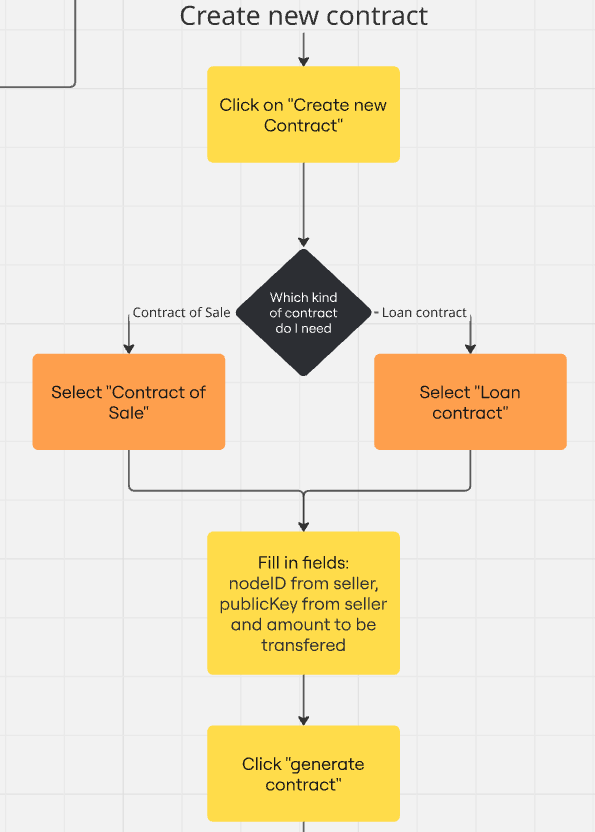

# BTContract - Fast. Safe. Effortless. Bitcoin made simple


## Introduction
BTContract simplifies smart contract creation on the Bitcoin network, allowing anyone to make loans and purchases without needing technical knowledge. With built-in Lightning Network support, it enables fast, low-cost transactions, making decentralized finance more accessible worldwide.

## Features
- Smart Contracts Builder
- Integration with the Lightning Network
- Reusable Contract Templates
- Contract History

## Instalação 
### Back-end e Blockchain
1. Pré-requisitos:
- Possuir o Docker e WSL2/uma distribuição linux instalados em seu computador

2. Instale o Rust
- ```curl --proto '=https' --tlsv1.2 -sSf https://sh.rustup.rs | sh```

3. Instale uma IDE (recomendamos utilizar o VSCode, o qual pode ser instalado no link abaixo)
- https://code.visualstudio.com/

4. Instale o Foundry
- ```curl -L https://foundry.paradigm.xyz | bash```

5. Instale e ative o Nitro devnode
- ```git clone https://github.com/OffchainLabs/nitro-devnode.git```
- ```cd nitro-devnode```
- ```./run-dev-node.sh```

6. Instale o cargo stylus
- ```cargo install --force cargo-stylus```

7. Adicione o WASM
- ```rustup default 1.80```
- ```rustup target add wasm32-unknown-unknown --toolchain 1.80```

### Front-end

1. Instale as dependências necessárias
- ```npm install```

2. Rode a aplicação web
- ```npm start```

## Estrutura de pastas

```
HACKATHON-BH
├── certificado-nft
│   └── ...
├── client
│   └── ...
├── scroll
|   └── ...
├── token-smd
|   └── ...
├── README.MD
│   
```

- certificado-nft
    - Pasta com o projeto certificado como nft emitido na Arbitrum com Arbitrum Stylus
- client
    - Pasta com projeto React
- scroll
    - Pasta com NFTs emitidos na Scroll
- token-smd
    - Pasta com o projeto token simulador (SMD) como erc-20 emitido na Arbitrum com Arbitrum Stylus

## Tech Stacks

### Backend & Blockchain

#### Blockchains
- Bitcoin

#### Pacotes externos
- rustup
- rustc
- cargo

### Front-end

#### Pacotes externos
- React

## System Flow
<div align="center">
<sub>Figure 0X - BPMN Diagram</sub>

<sup>Source: Material produced by the authors (2025)</sup>
</div>
This application allows users to create, manage, and deploy Bitcoin-based contracts without needing to know Bitcoin script coding. Similar to platforms like OpenZeppelin, it abstracts the complexity of smart contract creation on the Bitcoin layer, making it accessible to non-technical users.

---
### 1. Account Creation & Authentication
<div align="center">
<sub>Figure 0X - BPMN Diagram - Part 1</sub>

<sup>Source: Material produced by the authors (2025)</sup>
</div>

- Users start by accessing the main page
- They click on "Getting Started"
- If they don't have an account:
  - Click "Create an Account"
  - Register by providing name, email, password, and public key
- If they already have an account:
  - Click "Login"
  - Fill in email and password fields
- After authentication, users are directed to the main view page
---

### 2. Main Navigation Decision
<div align="center">
<sub>Figure 0X - BPMN Diagram - Part 2</sub>

<sup>Source: Material produced by the authors (2025)</sup>
</div>

After login, users can choose between two main paths:
- Visualize existing contracts
- Create new contracts

---


### 3. Visualizing Existing Contracts
<div align="center">
<sub>Figure 0X - BPMN Diagram - Part 3</sub>

<sup>Source: Material produced by the authors (2025)</sup>
</div>

To view existing contracts:
- Click on "Visualize my contracts"
- Select a contract from those already created
- View detailed information about the contract and signature of addressee
---


### 4. Creating New Contracts

<div align="center">
<sub>Figure 0X - BPMN Diagram - Part 4</sub>

<sup>Source: Material produced by the authors (2025)</sup>
</div>

To create a new contract:
- Click on "Create new Contract"
- Choose the type of contract needed:
- Fill in all required fields for the selected contract type
- Click "generate contract" to create the contract

### 5. Contract Deployment

<div align="center">
<sub>Figure 0X - BPMN Diagram - Part 5</sub>

<sup>Source: Material produced by the authors (2025)</sup>
</div>

After generating the contract:
- System checks if user has a premium plan
- If Yes:
  - User can select "Generate Juridical Contract" for enhanced legal features
- If No (or after juridical contract generation):
  - User confirms contract details
  - Clicks "Deploy" to send the contract via email to the recipient

## Key Features
- Simplified contract creation without Bitcoin scripting knowledge
- Two contract types (Sale and Loan) with customizable parameters
- Premium option for juridical contract generation
- Contract visualization tools
- Automated deployment and recipient notification

## Roadmap
Planejamos implementar outras funcionalidades ao pensar no projeto a longo prazo, sendo elas:
- Criação de match-making com IA entre empresas interessadas e candidatos;
- Criação de programas B2B de capacitação para colaboradores de empresas parceiras;
- Desenvolvimento de trilhas educacionais e técnicas voltadas para negócios e criptoativos;
- Desenvolvimento de projetos mensais entre empresas e alunos da plataforma;

## Agradecimentos
Um agradecimento especial à equipes de organização do Modular Carnival e a Arbitrum e Scroll pela oportunidade. 
